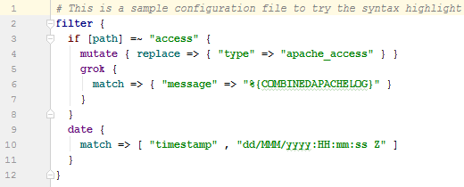
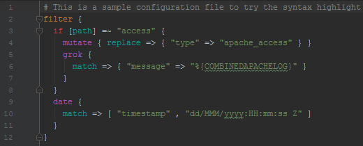

# IntelliJ Logstash configuration highlight

Syntax highlight for logstash configuration files on all JetBrain IDEs (IntelliJ, RubyMine, PhpStorm, AppCode, PyCharm, CLion, Android Studio and Webstorm)

# Installation

## Import settings (recommended)
1. Download [`logstash-conf.jar`](https://github.com/ycintre/intellij-logstash-conf-filetype/raw/master/logstash-conf.jar)
1. Open IntelliJ
1. Click on `File` > `Import Settings...`
1. Browse to the downloaded `jar` (_tip:_ you can also drag & drop the `jar` from your file explorer to the `Import File Location` window) and click `OK`
1. Be sure to check `File types (schemes)` and click `OK`
1. Restart IntelliJ when prompted

## Manual
1. Download [`logstash-conf.xml`](https://github.com/ycintre/intellij-logstash-conf-filetype/raw/master/logstash-conf.xml)
1. Close IntelliJ
1. Copy the `xml` to `<your_home_dir>\<intellij_settings_dir>\config\filetypes\` (create folder `filetypes` if it doesn't exists)
1. Open IntelliJ

# Highlighted syntax and keywords
The filetype use IntelliJ sandard 4 colors highlight system

## Color 1
Highlight basic pipeline keywords: `filter`, `input`, `output`

See [`1-pipeline.md`](keywords/1-pipeline.md) for the full keyword list

## Color 2
Highlight plugins names:
- [Input Plugins](https://www.elastic.co/guide/en/logstash/current/input-plugins.html)
- [Output Plugins](https://www.elastic.co/guide/en/logstash/current/output-plugins.html)
- [Filter Plugins](https://www.elastic.co/guide/en/logstash/current/filter-plugins.html)
- [Codec Plugins](https://www.elastic.co/guide/en/logstash/current/codec-plugins.html)

See [`2-plugins-names.md`](keywords/2-plugins-names.md) for the full keyword list 

## Color 3
Highlight plugins actions

See [`3-codec-plugins-actions.md`](keywords/3-codec-plugins-actions.md), [`3-filter-plugins-actions.md`](keywords/3-filter-plugins-actions.md), [`3-input-plugins-actions.md`](keywords/3-input-plugins-actions.md) and [`3-output-plugins-actions.md`](keywords/3-output-plugins-actions.md) for the full keyword list 

## Color 4
Highlight conditional operators

See [`4-conditional.md`](keywords/4-conditional.md) for the full keyword list 
